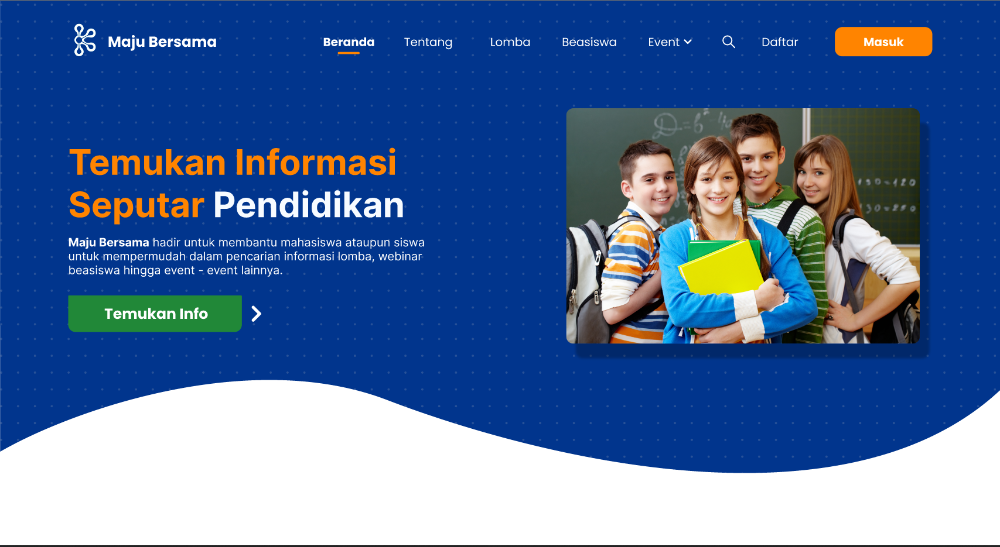

 
<h1 align="center">Final Project Program</h1>

<h1 align="center">Maju Bersama</h1>

Hadir untuk membantu mahasiswa ataupun siswa 
untuk mempermudah dalam pencarian informasi lomba, webinar
beasiswa hingga event - event lainnya.
 

 

## Program apa ini?
Maju Bersama merupakan sebuah platform yang menyediakan berbagai info lomba, beasiswa hingga event dari berbagai instansi penyelenggara. 

## Kenapa program ini dibuat?
Seiring dengan banyaknya jumlah pencarian info lomba dan juga beasiswa oleh siswa dan mahasiswa, hal tersebut ternyata berbanding terbalik dengan peningkatan kejelasan dan juga kepastian informasi yang tersebar khususnya di Indonesia. Sehingga menyebabkan penyebaran informasi tentang lomba, beasiswa hingga event" tertentu menjadi kurang terlihat. Maka, dibutuhkan sebuah aplikasi yang dapat memuat berbagai macam informasi terkait lomba hingga beasiswa, yang dimana dapat mencari jenis lomba dan beasiswa yang mereka minati dengan mudah dan cepat.

## Fitur yang dimiliki?
* Membuat to-do list dengan properti
    * Nama tugas
    * Kelompok tugas (berfungsi untuk mengelompokan tugas)
    * **Prioritas**
    * Deadline (informasi tentang waktu tersisa)
* Mengedit properti to-do list
* Menghapus to-do list
* Melihat to-do list dengan beberapa cara
    * Melihat semua to-do list
    * Mencari to-do list
    * Mengurutkan sesuai dengan :
        * Kelompok tugas
        * Prioritas
        * Siswa waktu
* Penyimpanan to-do list agar data pengguna tidak hilang saat program dihentikan

 ## Contributor
  * Ivan Luis Simarmata
  * Komang Kartika Noviyanti
  * I Gst Ayu Purnami Pinatih
  * Alvin Wiraprathama
  * I Gusti Bgs Darmika Putra
  * I Putu Agus Arya Wiguna
